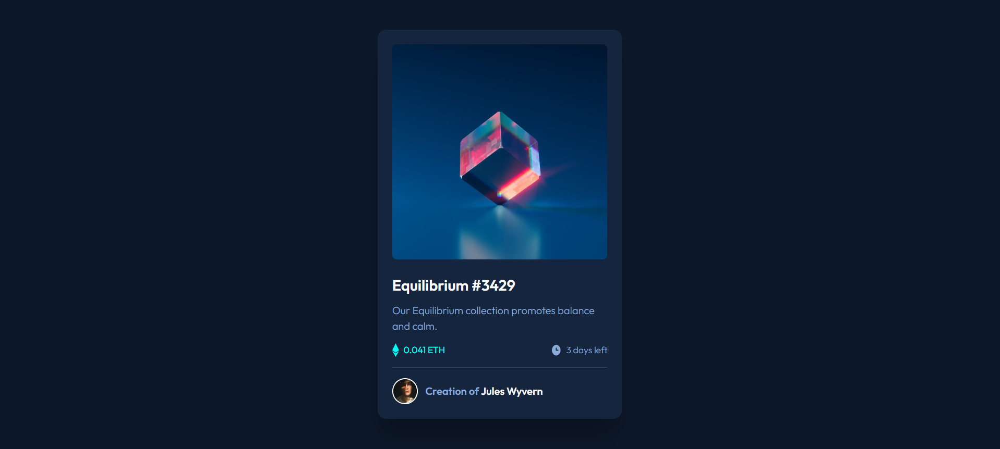

# Frontend Mentor - NFT preview card component solution

This is my solution to the [NFT preview card component challenge on Frontend Mentor](https://www.frontendmentor.io/challenges/nft-preview-card-component-SbdUL_w0U).

## Table of contents

- [Overview](#overview)
  - [The challenge](#the-challenge)
  - [Screenshot](#screenshot)
  - [Links](#links)
- [My process](#my-process)
  - [Built with](#built-with)
  - [What I learned](#what-i-learned)
  - [Continued development](#continued-development)
  - [Useful resources](#useful-resources)
- [Author](#author)

---

## Overview

### The challenge

Users should be able to:

- View the optimal layout depending on their device's screen size
- See hover states for interactive elements

### Screenshot



### Links

- Solution URL: [Frontend Mentor Solution](https://www.frontendmentor.io/solutions/responsive-nft-card-using-flexbox-and-custom-properties-XXXX)
- Live Site URL: [Live Demo](https://your-live-site-url.com)

---

## My process

### Built with

- Semantic HTML5 markup
- CSS custom properties
- Flexbox
- Mobile-first workflow

### What I learned

In this project, I strengthened my understanding of:

- Using `box-shadow` for depth and visual interest
- Positioning elements using `relative` and `absolute`
- Creating hover overlay effects with `transform: translate(-50%, -50%)`
- Structuring components using BEM-style naming

#### Example Code Snippets

```html
<div class="card__images">
  
  
</div>
```

```css
.card__images {
  position: relative;
}

.overlay-img {
  position: absolute;
  top: 50%;
  left: 50%;
  transform: translate(-50%, -50%);
  display: none;
}

.card__images:hover .overlay-img {
  display: block;
}
```

## Continued Development

I plan to continue improving in the following areas:

- CSS animations and transitions for smoother hover effects
- Responsive layouts using `clamp()`, `min()`, and `max()` units
- Better accessibility practices (e.g. alt text, focus states)

---

## Useful Resources

- [MDN - box-shadow](https://developer.mozilla.org/en-US/docs/Web/CSS/box-shadow) – Helped me understand all the values for `box-shadow`
- [CSS Tricks - Positioning](https://css-tricks.com/almanac/properties/p/position/) – Clarified how `relative` and `absolute` positioning work
- [Frontend Mentor Community](https://www.frontendmentor.io/community) – Great for learning best practices from others' solutions

---

## Author

- Frontend Mentor – [@Esabdul](https://www.frontendmentor.io/profile/Esabdul)
- GitHub – [@Esabdul](https://github.com/Esabdul)

---

## Acknowledgments

Thanks to the Frontend Mentor community and creators for this challenge.
It was a fun and rewarding experience that helped reinforce key layout concepts.
